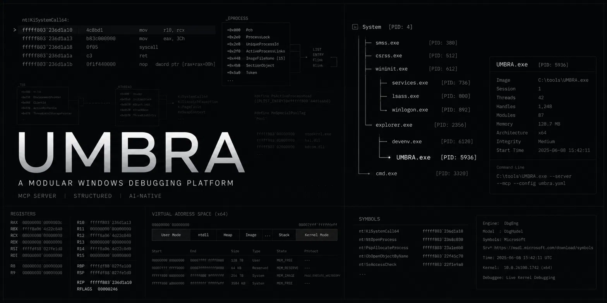

# Umbra

> A Windows debugging platform with an MCP frontend.

Umbra is a Rust MCP (Model Context Protocol) server exposing Windows debugging capabilities as structured, typed objects instead of raw console text. It wraps Microsoft's `dbgeng` COM engine (the WinDbg engine) via the `windows` crate, providing a multi-session debugging backend consumable by CLI tools, GUI frontends, REST APIs, IDE plugins, and AI agents.

Because the tool surface is reachable by autonomous agents, the free-form command path is gated by a **default-deny allowlist** (see [Security](#security)) rather than a denylist.

## Architecture

```
Claude / GPT / Cursor / VS Code
              │
       MCP Protocol (stdio)
              │
┌─────────────────────────────┐
│  umbra (MCP Server)         │
│  • Session Manager          │
│  • TTD Manager              │
│  • Tool Router              │
│  • JSON Serialization       │
└──────────────┬──────────────┘
               │
┌──────────────┴────────────────┐
│  debugger (Orchestrator)      │
│  • attach / detach / break    │
│  • memory / registers         │
│  • stack / modules / symbols  │
│  • kernel drivers / handles   │
└──────────────┬────────────────┘
               │
┌──────────────┴────────────────┐
│  dbgeng (COM Bindings)        │
│  • IDebugClient               │
│  • IDebugControl              │
│  • IDebugSymbols(3)           │
│  • IDebugDataSpaces           │
│  • IDebugRegisters            │
│  • IDebugSystemObjects        │
└──────────────┬────────────────┘
               │
           dbgeng.dll
               │
     Windows / Dump / Remote
```

## Crates

| Crate | Responsibility | Status |
|---|---|---|
| `common` | Error types, COM init, input validation (command allowlist), fast hex, `Result` alias | ✅ Complete |
| `models` | DTOs and JSON schemas for MCP responses (addresses as hex strings) | ✅ Complete |
| `dbgeng` | Safe wrappers around `dbgeng` COM interfaces | ✅ Complete (ANSI-only — see limitations) |
| `debugger` | Session orchestration — attach, detach, break, step, memory, kernel walks | ✅ Complete (kernel walks need live-kernel validation) |
| `disassembler` | Zydis-powered instruction decoding (x86/x64 only) | ✅ Complete |
| `extensions` | Extension output/event capture; allowlist-gated command invocation | ✅ Complete |
| `etw` | Event Tracing for Windows (`ferrisetw`) | ✅ Complete |
| `symbols` | Offline PDB type resolution (`pdb` crate) | ✅ Complete |
| `ttd` | Time Travel Debugging via Microsoft's TTD ReplayApi FFI | ⚠️ Experimental — unverified against a live trace/DLL |
| `umbra` | MCP server binary — tool router + session + TTD managers | ✅ Complete |

There is no separate `kernel` crate: kernel driver/handle enumeration lives in `debugger` (`do_list_drivers`, `do_list_handles`).

## MCP Tools

| Tool | Description | Status |
|---|---|---|
| `debug_attach` | Create session, attach to process / dump / kernel | ✅ |
| `debug_detach` | Destroy session, detach | ✅ |
| `session_list` | List active sessions | ✅ |
| `debug_break` | Break target execution (verifies the target actually stopped) | ✅ |
| `debug_resume` | Resume target execution | ✅ |
| `debug_step` | Single step | ✅ |
| `debug_read_memory` | Read bytes at address | ✅ |
| `debug_write_memory` | Write bytes at address (data as byte array or hex string) | ✅ |
| `debug_get_registers` | Get register values (integer regs decoded; float/vector as raw bytes) | ✅ |
| `debug_stack_trace` | Stack trace with symbol resolution | ✅ |
| `debug_list_modules` | List loaded modules (size/checksum/timestamp `null` when unavailable) | ✅ |
| `debug_list_processes` | List processes in session (OS PID + PEB via context switching) | ✅ |
| `debug_list_threads` | List threads (OS TID/PID + TEB; state reported `unknown`, start/priority omitted) | ✅ |
| `symbols_lookup` | Resolve symbol name to address (+ size when the symbol carries type info) | ✅ |
| `debug_resolve_type` | Resolve a type's layout (size + field offsets) from live symbols, e.g. `nt!_EPROCESS` | ✅ |
| `debug_disassemble` | Disassemble instructions at address (x86/x64 only) | ✅ |
| `debug_set_breakpoint` | Set breakpoint at address | ✅ |
| `debug_remove_breakpoint` | Remove breakpoint by ID | ✅ |
| `debug_list_breakpoints` | List breakpoints (reports `pass_count` + `current_pass_count`) | ✅ |
| `debug_poll_events` | Poll pending debugger events (breakpoints, exceptions, module loads) | ✅ |
| `kernel_list_drivers` | List kernel drivers (`PsLoadedModuleList` walk; kernel target) | ⚠️ Needs live-kernel validation |
| `kernel_list_handles` | List handles for a process (handle-table walk; Win10/11 x64; kernel target) | ⚠️ Needs live-kernel validation |
| `extensions_invoke` | Invoke an allowlisted inspection command (output captured) | ✅ |
| `etw_start` | Start ETW trace for a provider | ✅ |
| `etw_stop` | Stop ETW trace | ✅ |
| `etw_events` | Get ETW events | ✅ |
| `ttd_open` | Open a TTD `.run` trace for replay | ⚠️ Experimental |
| `ttd_seek` | Seek to a position (reports `ok`/`clamped`/`out_of_range`) | ⚠️ Experimental |
| `ttd_close` | Close a TTD trace and free its replay engine | ⚠️ Experimental |
| `pdb_resolve_type` | Resolve a type from a PDB file (offline, no session) | ✅ |
| `pdb_list_types` | List named types in a PDB file (offline, no session) | ✅ |

All address/pointer fields in responses are emitted as `0x`-prefixed **hex strings** (never bare JSON numbers), so kernel pointers above 2⁵³ survive re-parsing by a JavaScript/TypeScript MCP host. Address inputs accept a hex string, a decimal string, or a number.

## Security

`extensions_invoke` reaches `IDebugControl::Execute`, so it is treated as a security boundary rather than a convenience. `validate_debugger_command` (in `common`) applies, in order:

1. **Structural rejection** of the characters that enable command chaining, nesting, scripting, and redirection (`; | < > { } " ' \`` and newlines). This alone defeats `.block {.shell …}`, `$< script`, `a; b`, and `cmd > file`.
2. A **default-deny allowlist** for dot-commands (where every host-affecting verb lives), rejection of the `!!` shell alias, and rejection of alias-definition verbs (`aS`/`ad`, since dbgeng expands aliases at execution time).

The result: host code execution (`.shell`, `.load`/`.loadby`), process spawning, file writes (`.writemem`/`.dump`/`.logopen`/`.logappend`), and script sourcing are all denied, while read-only inspection and debuggee-scoped commands remain available. Loading extension DLLs is **not** exposed to agents at all (the library `load_extension` entry point is intentionally unrouted, since a DLL's `DllMain` is arbitrary native code).

## Building

Requires Windows with the Windows SDK or Debugging Tools for Windows installed (for `dbgeng.dll`).

```bash
cargo build -p umbra --release
# binary at target/release/umbra.exe
```

If `zydis` fails to build due to CMake generator detection:

```powershell
$env:CMAKE_GENERATOR="Visual Studio 17 2022"
cargo build -p umbra --release
```

Run the tests:

```bash
cargo test --workspace
```

## Usage

Umbra communicates via JSON-RPC over stdio (MCP standard).

```bash
./target/release/umbra.exe
```

Example session, piping requests via `echo`:

```bash
# Initialize
echo '{"jsonrpc":"2.0","id":1,"method":"initialize","params":{"protocolVersion":"2024-11-05","capabilities":{},"clientInfo":{"name":"test","version":"1.0"}}}' | ./target/release/umbra.exe

# Attach to process (PID 1234)
echo '{"jsonrpc":"2.0","id":2,"method":"tools/call","params":{"name":"debug_attach","arguments":{"target_type":"process","target":"1234"}}}' | ./target/release/umbra.exe

# Read memory (address as hex string or number)
echo '{"jsonrpc":"2.0","id":3,"method":"tools/call","params":{"name":"debug_read_memory","arguments":{"session_id":"<id>","address":"0x7ff600000000","size":64}}}' | ./target/release/umbra.exe

# Resolve a kernel type layout (kernel target with nt symbols)
echo '{"jsonrpc":"2.0","id":4,"method":"tools/call","params":{"name":"debug_resolve_type","arguments":{"session_id":"<id>","type_name":"nt!_EPROCESS"}}}' | ./target/release/umbra.exe
```

## Symbol Configuration

Set `_NT_SYMBOL_PATH` before starting Umbra (Umbra also falls back to the Microsoft public symbol server automatically):

```powershell
$env:_NT_SYMBOL_PATH="cache*c:\sym;SRV*https://msdl.microsoft.com/download/symbols"
./target/release/umbra.exe
```

For offline type resolution without a live session, use `pdb_resolve_type` / `pdb_list_types` with a local PDB path.

## Known Limitations

1. **Disassembly is x86/x64 only.** ARM64 targets return `NotSupported` from `debug_disassemble` (rejected before decode); Zydis does not handle ARM encodings.
2. **Float/vector registers are returned as raw little-endian bytes.** `xmm0`–`xmm15` and other float/vector registers are emitted as their raw `DEBUG_VALUE` byte layout. Integer registers are decoded and presented as conventional hex integer literals.
3. **Debugger event channel is best-effort.** Breakpoint/exception notifications share a bounded 4096-slot channel with module-load events; a burst of DLL loads during startup can drop events. Poll `debug_poll_events`; `GetExecutionStatus` remains ground truth for stops.
4. **ETW is system-global.** Only one real-time ETW trace can run across the OS at a time. Ownership is tracked per session; a session's trace is auto-stopped when the session is destroyed, and a final force-stop runs on process shutdown so a trace is never orphaned.
5. **Kernel driver/handle enumeration needs live-kernel validation.** `kernel_list_drivers` walks `nt!PsLoadedModuleList`; `kernel_list_handles` walks the process handle table with Win10/11 x64 `_HANDLE_TABLE_ENTRY` geometry (`ObjectPointerBits` reconstruction, `TypeIndex ^ (addr>>8) ^ nt!ObHeaderCookie` decode). Both require a kernel target with `nt` symbols and have not yet been validated against a live kernel; reads fail safe (an out-of-range type index is reported as `<invalid type index N>`).
6. **TTD replay is experimental and unverified.** `ttd_open`/`ttd_seek`/`ttd_close` drive Microsoft's TTD ReplayApi (`TTDReplay.dll`) through a hand-rolled vtable FFI with a reverse-engineered license handshake and vtable indices **pinned to a specific DLL build** (ported from `commial/ttd-bindings`). Engine/cursor are released on close (no leak), but nothing here has been validated against a real `.run` trace. On a mismatched DLL the handshake fails with a clear error rather than misbehaving.
7. **Paths and symbols are ASCII-only.** Dump paths, kernel connect strings, extension paths, and symbol names go through the ANSI (`...A`) engine entry points. Values not representable in the active ANSI code page (e.g. a dump under a non-ASCII user profile) may fail or be mangled. Prefer ASCII paths.
8. **No MCP push notifications.** The server cannot push breakpoint-hit notifications to the client; the client must poll `debug_poll_events`.
9. **Thread `state`, `start_address`, and `priority` are not populated.** `debug_list_threads` reports OS TID/PID and TEB; thread run-state is reported as `unknown` (the target is stopped during enumeration), and start address / priority are omitted (they require walking the TEB / an OS-level query).
10. **Free-form host/script execution is denied.** `extensions_invoke` is restricted to an allowlist of read-only inspection commands (see [Security](#security)); DLL loading, process/host execution, file writes, chaining, nesting, scripting, and redirection are all rejected.

## License

MIT — see [LICENSE](LICENSE).
